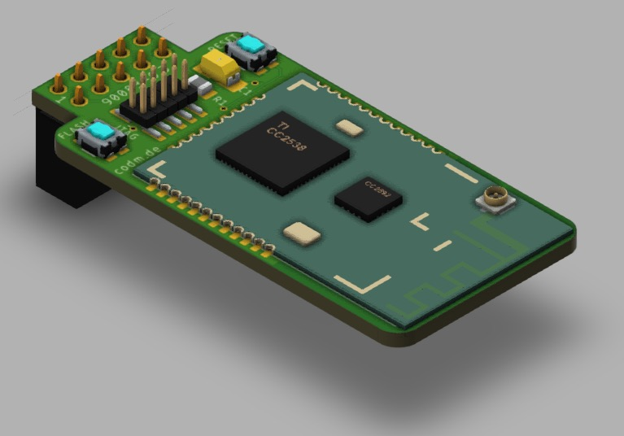
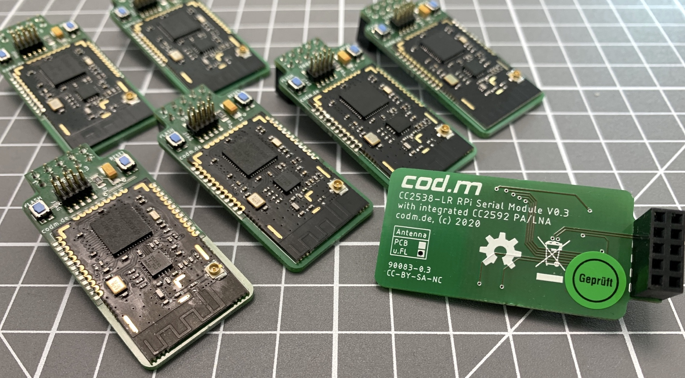
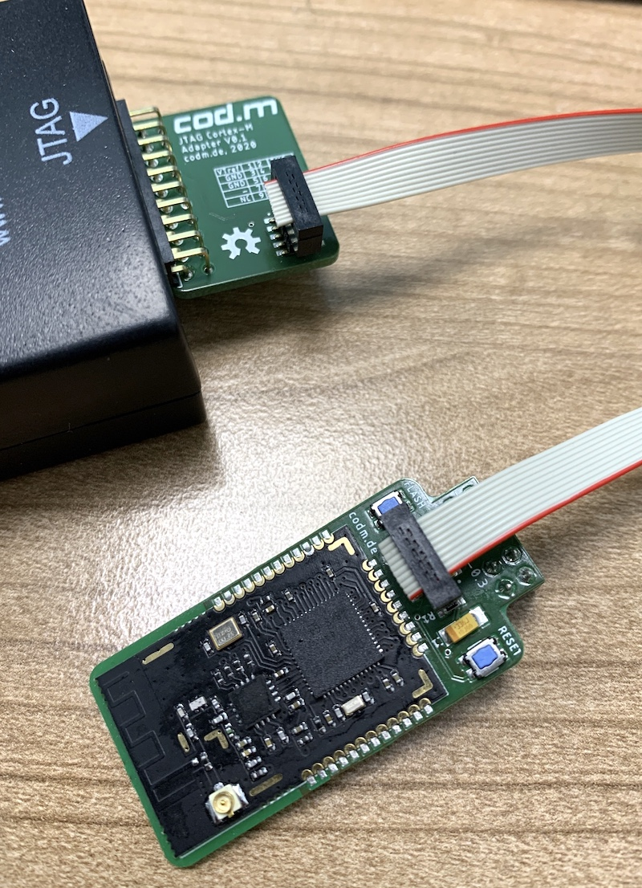

# cod.m ZigBee CC2538 Raspberry Pi module
[ZigBee CC2538 Raspberry Pi Coordinator](https://shop.codm.de/automation/zigbee/29/zigbee-cc2538-raspberry-pi-modul) - a ZigBee Coordinator designed for the GPIO of the Raspberry Pi running Z-Stack Firmware 3.0.x.
The used CC2538 module has an onboard CC2592 PA/LNA for range extension. Together with an external antenna this should make - depending on your surrounding - for a very good coverage.

According to [koenkk](https://github.com/Koenkk/Z-Stack-firmware/tree/master/coordinator) the CC2538 allows for up to 100 direct children and 200/400 routes directly on the coordinator. Keep in mind that the size of a ZigBee mesh is not defined by the count iof possible direct children of the coordinator, see https://www.zigbee2mqtt.io/information/FAQ.html#i-read-that-zigbee2mqtt-has-a-limit-of-20-devices-is-this-true

If you are interessted in the development of the module, take a look here: https://github.com/Koenkk/zigbee2mqtt/issues/1568#issuecomment-670571253

The corresponding eagle library for the CC2538 module, including 3D model - thanks to @co-Palko, can be found here: https://github.com/codm/eagle-libraries

You can buy a ready built coordinator, including external antenna at our webshop: https://shop.codm.de/automation/zigbee/29/zigbee-cc2538-raspberry-pi-modul





# Running
To us the module directly on the serial interface on the GPIO of the Raspberry Pi, you have to free it up first. Either completely or by moving the Bluetooth UART to the mini-uart.

See  https://www.raspberrypi.org/documentation/configuration/uart.md

# Antenna
We recommend to use only external antennas as the module is close to the WiFi and Bluetooth module/antenna on the Raspberry Pi. But if you want to use the attached PCB antenna, rotate the resistor pointing to the u.FL socket by 90° so it connects the PCB trace.

Well, that's a feature of the used CC2538 module 😉

# Firmware
The firmware is the same used on the modkam module, but adapted for direct UART use by @reverieline: https://github.com/reverieline/CC2538-CC2592-ZNP/

You can flash the firmware either by JTAG or directly from the Raspberry Pi using [cc2538-prog](https://github.com/1248/cc2538-prog/). 
Keep in mind, you have to flash a firmware with a serial bootloader (SBL) to use this feature again, e.g. `MODKAMRU_V3_UART-no-flow-control_with_SBL.hex`.

## JTAG
The 2x05 header is following the common [JTAG-Cortex-M0](https://www.segger.com/products/debug-probes/j-link/accessories/adapters/9-pin-cortex-m-adapter/) Layout.

The original adapter for the "normal" 20-pin JTAG layout is quite expensive, so we've built our own. You'll find alternatives around the web.



## Serial via GPIO
Install and compile cc2538-prog.

Hold down the `flash` button on the module and press `reset` shortly while still holding `flash`. The CC2538 should now be in the bootloder.

Then execute `./cc2538-prog -d /dev/ttyAMA0 -f MODKAMRU_V3_UART-no-flow-control_with_SBL.hex`

The output should look something like this: 
```
ping ok
Bootloader detected
Erasing page 0
Erasing page 1
[...]
Erasing page 254
Erasing page 255
Writing 16 bytes to 0x00200000
Writing 16 bytes to 0x00200010
[...]
Writing 16 bytes to 0x0023C7F0
Writing 12 bytes to 0x0027FFD4
```

After that reset the module using the corresponding button. 
It happened sometimes that I had to replug the module to get it to work again. 


# Thanks
* @koenkk Z-Stack Firmware - https://github.com/Koenkk/Z-Stack-firmware
* @reverieline UART Version of the Z-Stack firmware - https://github.com/reverieline/CC2538-CC2592-ZNP/tree/master/MODKAMRU_V3
* @co-Palko 3D model of the chinese module - https://github.com/co-Palko
* @1248 cc2538-prog - https://github.com/1248/cc2538-prog/

# License
[CC-BY-SA 3.0](https://creativecommons.org/licenses/by-sa/3.0/)

cod.m GmbH, Patrik Mayer, 2020